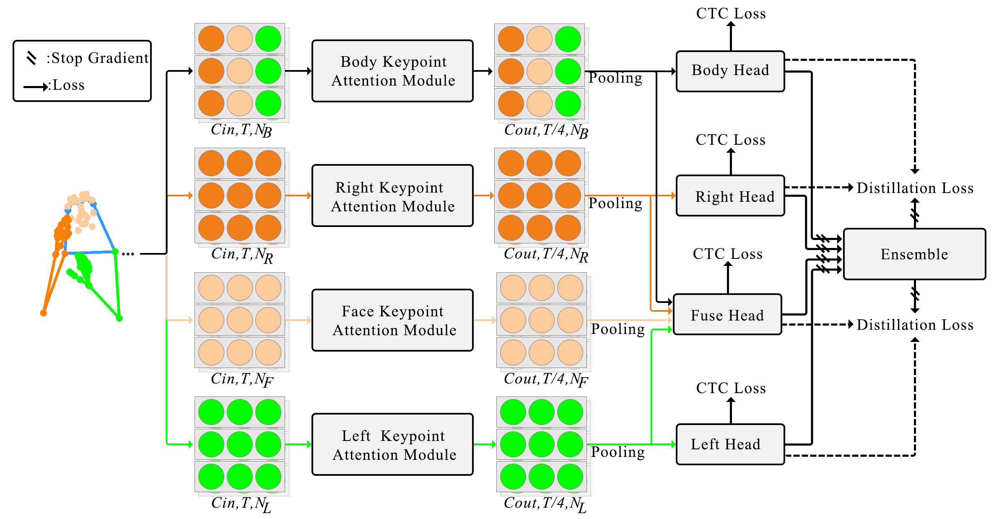

# MSKA

# Multi-Stream Keypoint Attention Network for Sign Language Recognition and Translation #

<a href="https://pytorch.org/get-started/locally/"></a>  [](https://arxiv.org/pdf/2405.05672)

[](https://paperswithcode.com/sota/sign-language-translation-on-rwth-phoenix?p=multi-stream-keypoint-attention-network-for)
[](https://paperswithcode.com/sota/sign-language-translation-on-csl-daily?p=multi-stream-keypoint-attention-network-for)
[](https://paperswithcode.com/sota/sign-language-recognition-on-csl-daily?p=multi-stream-keypoint-attention-network-for)
[](https://paperswithcode.com/sota/sign-language-recognition-on-rwth-phoenix-1?p=multi-stream-keypoint-attention-network-for)
[](https://paperswithcode.com/sota/sign-language-recognition-on-rwth-phoenix?p=multi-stream-keypoint-attention-network-for)

## Introduction
We propose a multi-stream keypoint attention network to depict a sequence of keypoints produced by a readily available keypoint estimator. In order to facilitate interaction across multiple streams, we investigate diverse methodologies such as keypoint fusion strategies, head fusion, and self-distillation. The resulting framework is denoted as MSKA-SLR, which is expanded into a sign language translation (SLT) model through the straightforward addition of an extra translation network.We carry out comprehensive experiments on well-known benchmarks like Phoenix-2014, Phoenix-2014T, and CSL-Daily to showcase the efficacy of our methodology. Notably, we have attained a novel state-of-the-art performance in the sign language translation task of Phoenix-2014T.



## Performance

**MSKA-SLR**
| Dataset | WER | Model | Training |
| :---: | :---: | :---: | :---: | 
| Phoenix-2014 | 22.1 | [ckpt](https://drive.google.com/drive/folders/1QZ50fT2nqGowG94K6tKDxmKLHjyqiJUl?usp=drive_link) | [config](configs/phoenix-2014_s2g.yaml) |
| Phoenix-2014T | 20.5 | [ckpt](https://drive.google.com/drive/folders/1kwn5_aEIswfVwf41I4EUOrUhdnHbYl80?usp=drive_link) | [config](configs/phoenix-2014t_s2g.yaml) |
| CSL-Daily | 27.7 | [ckpt] | [config](configs/csl-daily_s2g.yaml) |
 
**MSKA-SLT**
| Dataset | R | B1 | B2 | B3 | B4 | Model | Training |
| :---: | :---: | :---: | :---: | :---: | :---: | :---: | :---: |
| Phoenix-2014T | 53.54 | 54.79 | 42.42 | 34.49 | 29.03 | [ckpt](https://drive.google.com/drive/folders/1kQhvT-gJBfarkV2jtigBnO24Ial95znc?usp=drive_link) | [config](configs/phoenix-2014t_s2t.yaml) |
| CSL-Daily | 55.72 | 55.44 | 42.59 | 32.87 | 25.79 | [ckpt]| [config](configs/csl-daily_s2t.yaml) |

## Installation
```
conda create -n mska python==3.10.13
conda activate mska
# Please install PyTorch according to your CUDA version.
pip install -r requirements.txt
```

### Download

**Datasets**

Download datasets from their websites and place them under the corresponding directories in data/
* [Phoenix-2014](https://www-i6.informatik.rwth-aachen.de/~koller/RWTH-PHOENIX/)
* [Phoenix-2014T](https://www-i6.informatik.rwth-aachen.de/~koller/RWTH-PHOENIX-2014-T/)
* [CSL-Daily](http://home.ustc.edu.cn/~zhouh156/dataset/csl-daily/)

**Pretrained Models**
 
*mbart_de* / *mbart_zh* : [pretrained language models](https://drive.google.com/drive/folders/1u7uhrwaBL6sNqscFerJLUHjwt1kuwWw9?usp=drive_link) used to initialize the translation network for German and Chinese, with weights from [mbart-cc-25](https://huggingface.co/facebook/mbart-large-cc25).

We provide pretrained models [Phoenix-2014T](https://drive.google.com/drive/folders/1o_fmtmulKlCczz9HaYn0mpvyyCtw-lgs?usp=drive_link) and [CSL-Daily](https://drive.google.com/drive/folders/1IHM49Sp9HRSTvEHe-nf7YeMLm2G1WdS8?usp=drive_link). Download this directory and place them under *pretrained_models*.

**Keypoints**
We provide human keypoints for three datasets, [Phoenix-2014](https://drive.google.com/drive/folders/1D_iVtqeARBLO7WcZCTGCAdHXkKqHfF9X?usp=drive_link), [Phoenix-2014T](https://drive.google.com/drive/folders/1XBBqsxJqM4M64iGxhVCNuqUInhaACUwi?usp=drive_link), and [CSL-Daily](https://drive.google.com/drive/folders/11AOSOw1tkI78R6OFJv27adikr3OsUFBk?usp=drive_link), pre-extracted by HRNet. Please download them and place them under *data/Phoenix-2014t(Phoenix-2014 or CSL-Daily)*.

## MSKA-SLR Training
```
python train.py --config configs/${dataset}_s2g.yaml --epoch 100
```

## MSKA-SLR Evaluation
```
python train.py --config configs/${dataset}_s2g.yaml --resume pretrained_models/${dataset}_SLR/best.pth --eval
```

## MSKA-SLT Training
```
python train.py --config configs/${dataset}_s2t.yaml --epoch 40
```

## MSKA-SLT Evaluation
```
python train.py --config configs/${dataset}_s2t.yaml --resume pretrained_models/${dataset}_SLT/best.pth --eval
```

## Citations
```
@misc{guan2024multistream,
      title={Multi-Stream Keypoint Attention Network for Sign Language Recognition and Translation}, 
      author={Mo Guan and Yan Wang and Guangkun Ma and Jiarui Liu and Mingzu Sun},
      year={2024},
      eprint={2405.05672},
      archivePrefix={arXiv},
      primaryClass={cs.CV}
}
```

